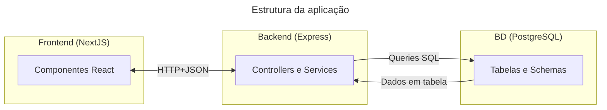
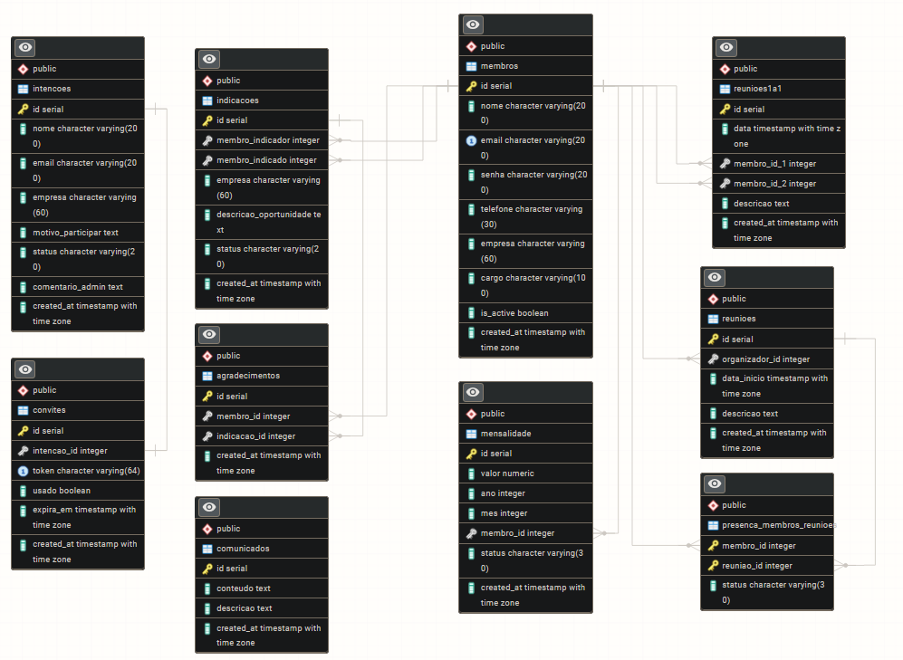
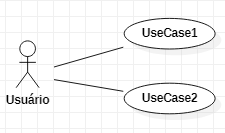

# Descrição da Arquitetura do software - Plataforma de Gestão para Grupos de Networking

#### **Escopo**: 
Esse documento tem como escopo a descrição da arquitetura da plataforma desenvolvida, seguindo conceitos do padrão ISO/IEC/IEEE 42010, e usando UML e Mermaid para a criação dos diagramas.

#### **Contexto**:
Esse documento faz parte de um teste técnico no processo seletivo para vaga de desenvolvedor *fullstack* na AG Soluções. 

## **Resumo**:
Aplicação web para gerenciar membros, presença, indicações e financeiro de um grupo de networking.  

Stack proposta:
- Frontend: **Next.js** e **React**
- Backend: **Node.js** e **Express**
- Banco de dados: **Relacional - PostgreSQL** [(Justificativas abaixo)](#Justificativas)
- Testes front: **Vitest** + **React Testing Library**
- Testes back: **Jest** + **Supertest** + **Testcontainers**

Autenticação administrativa: Simples via variável de ambiente (Variável `SENHA_ADMIN` definida no arquivo `.env` do backend) para o escopo do teste

## Entregáveis:

#### **(1) Diagrama de Componentes da aplicação**



#### **(2) Modelo de dados da aplicação**
O modelo de dados da aplicação é relacional, com banco de dados PostgreSQL. [(Justificativas abaixo)](#Justificativas)
O script SQL usado para criação das tabelas está em `plataforma_networking/backend/initDB/001_schema.sql`

Abaixo está o Diagrama Entidade-Relacionamento:



(Obs: Para permitir administração de múltiplos grupos por sistema, bastaria criar uma tabela `Grupos` e adicionar uma coluna `grupo_id` nas tabelas de `intenções`, `membros`, `comunicados` e `reuniões` para relacioná-los a um grupo. Como a descrição da tarefa refere-se a "um grupo de networking", foi presumido que existe apenas um grupo por sistema.)

#### **(3) Organização dos componentes React**
O projeto está organizado com pastas claras separadas por responsabilidade, com arquivos de teste ao lado de cada componente, e seguindo os novos padrões da versão 16 do next.js.
A adoção da versão 16 permite o uso do App Router e de layouts aninhados, o que facilita o reaproveitamento e aninhamento de páginas e componentes. Nessa versão, o roteamento é feito a partir do diretório `/app` e usando o nome dos diretórios filhos que contém arquivos `page.tsx`. Então `/app/intencoes/page.tsx` seria acessado por `nomedoapp.com/intencoes`.

Abaixo está descrita a estrutura de diretórios de forma gráfica:

```
/app
    layout.tsx                # layout root
    page.tsx                  # pagina root
    /context                  # gerenciadores de estado
    /components
        /ui                   # componentes primitivos
            botao
            inputTexto
            select
            ...
        /features             # componentes separados por domínio
            /intencoes
                ...
            /indicacoes
                ...
            /intencoes
                ...
            /membros
                ...
    /intencoes                # rotas para paginas de intencoes (nova estrutura de rotas next.js v16)
        ...
    /indicacoes               # rotas para paginas de indicacoes
        ...
    /login                    # rotas para paginas de login
        ...
    /membros                  # rotas para paginas de membros
        ...
    /services                 # gerenciadores de requisições http
        ...
/public
    ...
/utils
    ...
```

#### **(4) Definição da API** 

A documentação para alguns endpoints está descrita a seguir, podendo também ser vista numa página no navegador, construida pela biblioteca swagger. Para ver a página basta iniciar o backend e acessar a rota `/api-docs` (por ex.: localhost:3001/api-docs). A especificação usada pelo swagger para construir a página está no arquivo `backend/src/swagger.js`.

- 1 - Endpoint: Buscar intenções
```
Rota: GET /intencoes
Parametros: -
Respostas: [
    Código: 200,
    Descrição: Lista de intenções
    Tipo: Application/json
    Formato: {
        id: int,
        nome: string,
        email: string,
        empresa: string,
        motivo_participar: string,
        status: string,
        created_at: string (data no formato ISO)
    }
]
```

- 2 - Endpoint: Cadastrar intenção
```
Rota: POST /intencoes
Parametros: -
Corpo (obrigatório): {
    "nome": string,
    "email": string,
    "empresa": string,
    "motivo_participar": string
}
Respostas: [
    Código: 201,
    Descrição: Intenção cadastrada com sucesso
    Tipo: Application/json
    Formato: {
        id: int,
        nome: string,
        email: string,
        empresa: string,
        motivo_participar: string,
        status: string,
        created_at: string (data no formato ISO)
    },

    Código: 400,
    Descrição: Erro de validação
    Tipo: Application/json
    Formato: {
        errors: string[],
        status: int
    }
]
```

- 3 - Endpoint: Alterar status de uma intenção
```
Rota: PUT /intencoes/{id}/status
Parametros: {id: int}
Corpo (obrigatório): {
    "bool_aprovar": boolean
}
Respostas: [
    {Código: 204,
    Descrição: Status alterado com sucesso},

    {Código 400,
    Descrição: Erro de validação},

    {Código 404,
    Intenção não encontrada}
]
```


---
# Descrição da arquitetura do software

## 1. Ponto de vista (viewpoint) - Estrutura da aplicação

### **Sistemas:** 
- Plataforma Web de gestão para grupos de *networking* 

### **Stakeholders:** 
- Desenvolvedor(es)

### **Concerns**: 
Funcionalidade, uso, recursos do sistema, propriedades do sistema, estrutura, comportamento, desempenho, confiabilidade, segurança, complexidade, prazo, qualidade de serviço, modularidade, garantia e manutenção.

### **Constraints**: 
  - Desenvolvedor(es): Funcionalidade, desempenho, uso, estrutura, segurança, modularidade, complexidade, recursos do sistema, propriedades do sistema, comportamento, manutenção, prazo.

### **Razão da inclusão do ponto de vista**
Esse ponto de vista foi incluído para mostrar e documentar a estrutura do sistema, auxiliando desenvolvedores.

### **Propósito**: 
- Projeção
Viewpoints de projeção auxiliam arquitetos e projetistas desde o esboço inicial até a projeção detalhada.

### **Decisões-chave (key decisions) do ponto de vista**:

##### Decisão 1: **Banco de dados - PostgreSQL**

###### **Justificativas**: 
- Dados fortemente relacionais (membros, intenções, indicações, pagamentos); 
- O uso de consultas agregadas facilita a criação de dashboards e relatórios;
- Integridade referencial e flexibilidade com JSONB caso precise de dados semi-estruturados;

###### **Concerns**: 
Funcionalidade, uso, propriedades do sistema, limitações conhecidas, estrutura, desempenho, complexidade, evolutibilidade, prazo, objetivos e estratégias de negócio, manutenção

###### **Responsável pela decisão**: 
- Desenvolvedor

###### **Alternativas consideradas**: 
- SQLite
- MongoDB

###### **Consequências**: 
- Dados são relacionados mais facilmente; 
- criação de dashboards e relatórios mais facilmente; 
- criação e comunicação com o banco de dados menos facilmente (do que com SQLite). 

###### **Tempos da decisão**: 
- Decisão tomada e aprovada antes da fase de implementação do sistema. Não foi alterada.

##### Decisão 2: **Framework Backend - Express**

###### **Justificativas**: 
- Pela natureza da aplicação ser simples, Express é uma boa escolha pois proporciona um *framework* minimalista, rápido, e com estrutura flexível; 
- Separar o backend do frontend permite melhor escalamento horizontal da aplicação, em contraste com uso de um framework fullstack;
- Desenvolvedor possui conhecimentos prévios com o *framework* Express.

###### **Concerns**: 
Funcionalidade, uso, propriedades do sistema, estrutura, desempenho, complexidade, evolutibilidade, prazo, manutenção, flexibilidade.

###### **Responsável pela decisão**: 
- Desenvolvedor

###### **Alternativas consideradas**: 
- NestJS
- API Routes do NextJS

###### **Consequências**: 
- Backend customizável, simples e rápido; 
- Implementação rápida e sólida devido ao conhecimento prévio do desenvolvedor;
- Escalamento do backend independe do frontend, e vice-versa.

###### **Tempos da decisão**: 
- Decisão tomada e aprovada antes da fase de implementação do sistema. Não foi alterada.

### **Visualização da arquitetura**


## 2. Ponto de vista (viewpoint) - Produto

### **Sistemas:** 
- Plataforma Web de gestão para grupos de *networking* 

### **Stakeholders:** 
- Desenvolvedor(es)
- Usuários
- Gestores

### **Concerns**: 
Funcionalidade, recursos do sistema, estrutura, desempenho, confiabilidade, segurança, custo, qualidade de serviço, modularidade, garantia, objetivos e estratégias de negócio, experiência do cliente, manutenção.

### **Constraints**:
  - Desenvolvedor(es): Funcionalidade, desempenho, uso, segurança, modularidade, recursos do sistema, experiência do cliente, manutenção, estrutura.
  - Usuários: Funcionalidade, desempenho, qualidade do serviço, confiabilidade.
  - Gestores: Custo, objetivos e estratégias de negócio, garantia.

### **Razão da inclusão do ponto de vista**
Esse ponto de vista foi incluído para mostrar como é o produto final, seus usos e suas funcionalidades.

### **Propósito**: 
- Projeção
Viewpoints de projeção auxiliam arquitetos e projetistas desde o esboço inicial até a projeção detalhada.

- Decisão
Viewpoints de decisão auxiliam gerentes no processo de tomada de decisão,
oferecendo um entendimento das relações multi-domínio.

### **Decisões-chave (key decisions) do ponto de vista**:

##### Decisão 1: Módulo opcional - Sistema de Indicações

###### **Justificativas**: 
- As funcionalidades do sistema de indicações parecem ser mais importantes para a completude do sistema;
- Dados necessários para o sistema de indicações já são implementados no módulo de admissão de membros.

###### **Concerns**: 
Funcionalidade, recursos do sistema, propriedades do sistema, estrutura,complexidade.

###### **Responsável pela decisão**: 
- Desenvolvedor

###### **Alternativas consideradas**: 
- Módulo de Dashboard de Performance

###### **Consequências**: 
- Usuários membros podem cadastrar indicações

###### **Tempos da decisão**: 
- Decisão tomada e aprovada no início da fase de implementação do sistema. Não foi alterada.

###### **Visualização da arquitetura**

