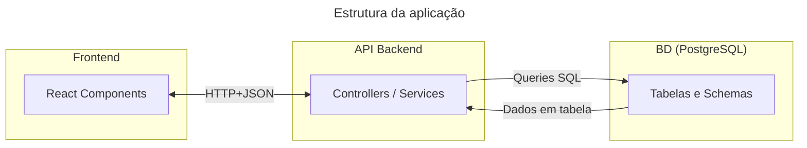
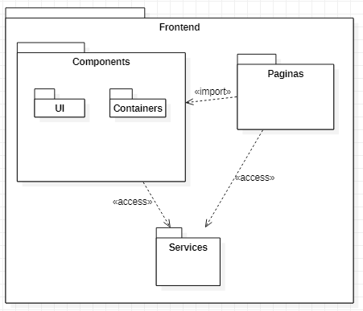

# Descrição da Arquitetura do software - Plataforma de Gestão para Grupos de Networking

#### **Escopo**: 
Esse documento tem como escopo a descrição da arquitetura da plataforma desenvolvida, seguindo conceitos do padrão ISO/IEC/IEEE 42010, incluindo identificação de stakeholders, concerns, viewpoints e key decisions, e UML para criação dos diagramas.

#### **Contexto**:
Esse documento faz parte de um teste técnico no processo seletivo para vaga de desenvolvedor *fullstack* na AG Soluções. 

## **Resumo**:
Aplicação web para gerenciar membros, presença, indicações e financeiro de um grupo de networking.  

Stack proposta:
- Frontend: **Next.js** e **React**
- Backend: **Node.js** e **Express**
- Banco de dados: **PostgreSQL** [(Justificativas abaixo)](#Justificativas)
- Testes: **Jest** + **React Testing Library**
- Autenticação administrativa: Simples via variável de ambiente (token) para o escopo do teste

#### Diagramas:

- (1) Diagrama de Componentes simplificado

- (2) Organização dos componentes React

---

## 1. Ponto de vista (viewpoint) - Estrutura da aplicação

### **Sistemas:** 
- Plataforma Web de gestão para grupos de *networking* 

### **Stakeholders:** 
- Desenvolvedor(es)

### **Concerns**: 
Funcionalidade, uso, recursos do sistema, propriedades do sistema, estrutura, comportamento, desempenho, confiabilidade, segurança, complexidade, prazo, qualidade de serviço, modularidade, garantia e manutenção.

### **Constraints**: 
  - Desenvolvedores: Funcionalidade, desempenho, uso, estrutura, segurança, modularidade, complexidade, recursos do sistema, propriedades do sistema, comportamento, manutenção, prazo.

### **Razão da inclusão do ponto de vista**
Esse ponto de vista foi incluído para mostrar e documentar a estrutura do sistema, auxiliando desenvolvedores.

### **Propósito**: 
- Projeção
Viewpoints de projeção auxiliam arquitetos e projetistas desde o esboço inicial até a projeção detalhada.

### **Decisões-chave (key decisions) do ponto de vista**:

##### Decisão 1: **Banco de dados - PostgreSQL**

###### **Justificativas**: 
- Dados fortemente relacionais (membros, intenções, indicações, pagamentos); 
- O uso de consultas agregadas facilita a criação de dashboards e relatórios;
- Integridade referencial e flexibilidade com JSONB caso precise de dados semi-estruturados;

###### **Concerns**: 
Funcionalidade, uso, propriedades do sistema, limitações conhecidas, estrutura, desempenho, complexidade, evolutibilidade, prazo, objetivos e estratégias de negócio, manutenção

###### **Responsável pela decisão**: 
- Desenvolvedor

###### **Alternativas consideradas**: 
- SQLite
- MongoDB

###### **Consequências**: 
- Dados são relacionados mais facilmente; 
- criação de dashboards e relatórios mais facilmente; 
- criação e comunicação com o banco de dados menos facilmente. 

###### **Tempos da decisão**: 
- Decisão tomada e aprovada antes da fase de implementação do sistema. Não foi alterada.

###### **Visualização da arquitetura**

## 2. Ponto de vista (viewpoint) - Produto

### **Sistemas:** 
- Plataforma Web de gestão para grupos de *networking* 

### **Stakeholders:** 
- Desenvolvedor
- Usuários
- Gestores

### **Concerns**: 
Funcionalidade, recursos do sistema, estrutura, desempenho, confiabilidade, segurança, custo, qualidade de serviço, modularidade, garantia, objetivos e estratégias de negócio, experiência do cliente, manutenção.

### **Constraints**:
  - Desenvolvedores: Funcionalidade, desempenho, uso, segurança, modularidade, recursos do sistema, experiência do cliente, manutenção, estrutura.
  - Usuários: Funcionalidade, desempenho, qualidade do serviço, confiabilidade.
  - Gestores: Custo, objetivos e estratégias de negócio, garantia.

### **Razão da inclusão do ponto de vista**
Esse ponto de vista foi incluído para mostrar como é o produto final, seus usos e suas funcionalidades.

### **Propósito**: 
- Projeção
Viewpoints de projeção auxiliam arquitetos e projetistas desde o esboço inicial até a projeção detalhada.

- Decisão
Viewpoints de decisão auxiliam gerentes no processo de tomada de decisão,
oferecendo um entendimento das relações multi-domínio.

### **Decisões-chave (key decisions) do ponto de vista**:

##### Decisão 1: Módulo opcional - Sistema de Indicações

###### **Justificativas**: 
- 

###### **Concerns**: 
Funcionalidade, recursos do sistema, propriedades do sistema, estrutura,complexidade.

###### **Responsável pela decisão**: 
- Desenvolvedor

###### **Alternativas consideradas**: 
- Dashboard de Performance

###### **Consequências**: 
- 

###### **Tempos da decisão**: 
- Decisão tomada e aprovada no início da fase de implementação do sistema. Não foi alterada.

###### **Visualização da arquitetura**

